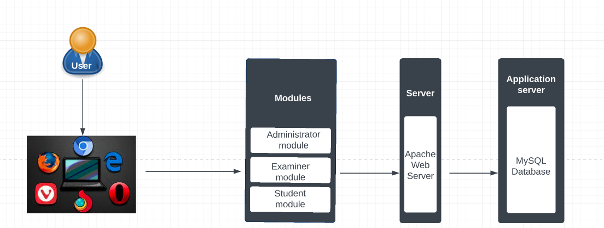

# Computer Based Testing System :page_facing_up:

This project [Computer Based Testing System](https://alx-cbt-system.live/) was completed using PHP script with Mysql Database. Other techologies used are;
* HTML
* CSS
* Javascript
* Bootstrap
* Ajax

## Architecture :couple:

## Features :speech_balloon:
###  General Features
        * Cross-platform
        * Responsive
        * Accessible
        * Supports objective questions

### User-specific features
* #### Student
        - Resumption capability for students
        - Automatic grading
        - Question randomization

* #### Examiner
        - Manage exams and set questions for assigned courses.
        - Activate exams.
        - Set exam time and instruction.
        - View all exam results of exams for assigned courses.

* #### Administrator
        - Register users and courses.
        - View users and courses.

## Demo :running:

## Installation :thumbsup:
* Enter https://alx-cbt-system.live/ into your browser
* Password: **soomy42**

| username | Category |
| ------------- | ------------- |
| admin  | Admin  |
| maarten_vm  | Examiner  |
| faith_okoth  | Examiner  |
| ALX408500  | Student  |
| ALX408501  | Student  |
| ALX408502  | Student  |

## Authors :black_nib:

* Ukonu Divine Chisom <[Gemma-Mariae](https://github.com/Gemma-Mariae)>
* Tadesse Miheret <[miheret-eng](https://medium.com/@mihherettad2007/3cc1ba8dbe6)>
* Ogor Nkemchor <[Nkem-wey-sabi](https://github.com/Nkem-wey-sabi)>

## License :pray:
Licensed under the [MIT License](LICENSE)
